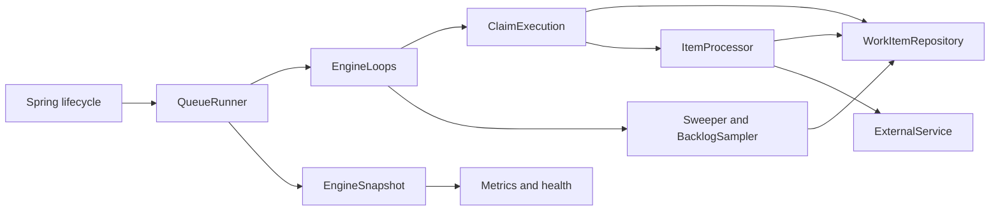

# DB Work Queue Deep Modules Implementation Plan

> **For agentic workers:** After explicit user approval, use `superpowers:executing-plans` for sequential execution in this chat, or `superpowers:subagent-driven-development` if the user selects delegation. Steps use checkbox (`- [ ]`) syntax for tracking.

**Status:** Implementation and fresh code review complete; 495 unit tests pass. Db2 integration verification awaits approval to download the required test image.

**Goal:** Make the existing engine understandable through deep modules and narrow interfaces while preserving its original production goals and all currently implemented behavior.

**Architecture:** Keep the existing execution and persistence algorithms. Give active claims one state owner, put loop management behind a lifecycle boundary, and give monitoring immutable read models. Keep the application-facing SPI small and document one clear path through the engine.

**Tech Stack:** Existing JDK 25, Spring Boot 4.1.1, JDBC/JCC, Db2 12.1.5.0, Micrometer, JUnit, AssertJ, Awaitility, and Testcontainers. No new runtime or architecture-test dependency.

**Spec:** [Original production design, revision 13](../specs/2026-09-21-db-work-queue-design.md). The structural changes proposed below replace its implementation ownership descriptions after approval; its functional contracts remain authoritative.

## 1. Intent and scope

The user's first priority is understanding the code through a small number of meaningful interfaces. The engine must retain concurrent distribution, dynamic instance counts, fenced database writes, downstream idempotency, crash/restart survival, bounded resources, recovery targets, and its planned operations/demo capabilities.

The user explicitly permits narrowing the current public Java API while preserving `ExternalService`, configuration names, and runtime behavior. No other repository module currently imports the engine. This is permission to propose visibility changes; implementation still waits for approval of this plan.

This refactor covers the code that exists today. Future auto-configuration, schema checks, admin endpoints, the demo, remaining runtime ITs, process tests, and load gates stay on the original roadmap. This refactor does not implement them or declare their requirements fulfilled.

### Approaches considered

| Approach | Result and tradeoff |
|---|---|
| **Ownership-based modules — recommended** | Moves state and its complete lifecycle behind meaningful interfaces. Preserves algorithms and allows incremental verification. |
| Add a public facade over the current structure | Cheap application integration improvement; leaves the internal understanding problem largely intact. |
| Replace execution with fixed worker loops | Can remove coordination machinery, but changes claiming, throughput, cancellation, and timing assumptions. Requires a separate behavioral redesign. |

The recommended approach treats a module as a responsibility with an information boundary. A module may have several implementation files. Smaller files and fewer public classes are supporting measures; the acceptance criterion is how much a caller needs to know.

## 2. Global constraints

- Preserve the Db2 schema, migration, SQL predicates, claim order, transaction boundaries, read-back behavior, and `SKIP LOCKED DATA` placement.
- Preserve one directly started virtual thread per claim, one external call per claim, and the existing five independent background loops. The supervisor stays independent of blocking DB operations.
- Preserve all `workqueue.*` property names, defaults, validation constraints B1–B5, renewal scheduling, and the conditional targets E1–E5, T1–T3, C1/C2. Do not strengthen their stated evidence or approval status.
- Important defaults remain: concurrency 16; claim batch 20; lease 100s; renew interval/retry 15s/1s; registration allowance 1s; external timeout 30s; processing deadline 120s; completion retries/delay 3/1s; shutdown grace/cancel wait 20s/5s.
- DB defaults remain: pool wait 2s; login 3s; transaction 5s; read 8s; lock wait 3s; W = 18s; pool size at least concurrency + 4. B2's default bound remains 74s and E5 remains 8s.
- Preserve all 21 metric names, their tags and counting rules, `FunctionTimer` semantics, backlog NaN/staleness behavior, and existing liveness/readiness decisions, including detection of all five dead loops.
- Preserve DB server timestamps for persisted time and overflow-safe `System.nanoTime()` differences for local time. Injected clocks remain available for race tests.
- Preserve redaction: no operation identity, idempotency key, payload, result, or downstream exception message in engine logs. Continue using `Diagnostics` for failures.
- Keep main code and unit tests in `hle.org.workqueue.engine`; use package-private access for implementation types. No new Maven modules, package hierarchy, generic scheduler framework, event bus, or interface per implementation class.
- Use the Maven wrapper from `db-work-queue/`. Unit tests do not start Db2. Db2 ITs require the existing Docker/Testcontainers setup.

## 3. Target structure: four things a reader needs to understand

| Boundary | Narrow interface | Complexity owned behind it |
|---|---|---|
| **Persistence: `WorkItemRepository`** | Existing domain operations: claim, renew, complete, retry/fail, sweep, sample, replay, revoke, namespace | Db2 syntax, transaction/timeouts, ordering, fencing, uncertain commits and read-back |
| **Active claims: `ClaimExecution`** | Claim/start a batch, renew a round, supervise, drain, cancel for shutdown, abort, read a summary | Capacity, handle registry, permit transfer, registration races, poll-failure recovery/backoff, task startup/finish, deadlines, renewal eligibility and lost claims |
| **Runtime: `QueueRunner` + `EngineLoops`** | Framework lifecycle on the runner; start/stop/abort and loop status internally | Five loop threads, schedules, flags, partial startup failure, joins, and graceful-stop sequencing |
| **Observation: `EngineSnapshot`, metrics and health adapters** | Immutable summaries and the existing framework adapters | Metric mapping, health decisions and safe monitoring of concurrent state |

`ItemProcessor` remains the deep operation-processing unit inside the active-claim responsibility. `ClaimHandle` remains its private implementation collaborator. `Sweeper` and `BacklogSampler` retain their existing pass logic inside the runtime responsibility. Existing timing helpers remain the policy implementation; their formulas are not redistributed through loop code.



The ordinary processing path remains: claim a batch within available capacity; start its tasks; make one external call per task; persist the outcome under its fence; finish the task and release capacity. Understanding this path requires the runtime outline, the active-claim interface, and `ItemProcessor.process()`.

### 3.1 State ownership

| State | Sole owner |
|---|---|
| Semaphore, registry, registration lock, cancel-on-registration gate, shared poll-failure counter/backoff policy, claim/renewal counters, outcomes | `ClaimExecution` |
| One claim's runner thread, deadline, cancellation, hung and ended state, lease-write origin | `ClaimHandle`, used by `ClaimExecution` |
| External-call timings and classifications | `ItemProcessor` |
| Five loop threads and their run flags | `EngineLoops` |
| Runner started/running/stopping lifecycle state and lifecycle lock | `QueueRunner` |
| Latest backlog sample, sample freshness and errors | `BacklogSampler` |
| Monotonic last-success time | Existing `DbActivity`; operation owners report successes to the shared recorder |
| Local construction-time settings | Immutable `EngineSettings`, extracted from existing `QueueRunner.Settings` |

Only `ClaimExecution` and `ClaimHandle` manipulate permits, registry entries, and the registration/cancellation protocol. Monitoring receives values rather than their mutable objects. The runner coordinates lifecycle operations without manipulating claim internals.

### 3.2 Application-facing Java API

Keep public: `ExternalService`, `IdempotencyKey`, `CallResult`, `WorkQueueProperties` and its binding-facing nested `Db`, and `ReplayFilter` for the original admin contract. Preserve the existing `ExternalService.call(...)` signature exactly.

Make implementation types package-private: `WorkItemRepository`, `ClaimedItem`, `ClaimKey`, `RenewalResult`, `PersistResult`, `BacklogSample`, `Outcome`, `DbTimeouts`, `TimingBudget`, and `RenewalSchedule`. The new runtime and snapshot types are also package-private. Public members nested inside an inaccessible implementation type do not become a supported API.

Do not add a second public queue API or manual bootstrap API during this refactor. The original Phase 3 auto-configuration remains the integration mechanism to be implemented later. Application code supplies the downstream SPI and configuration; it does not construct claim, timing, or thread machinery.

### 3.3 Internal signatures

These are the final module entry points, not a list of every private helper:

```java
// Copy the existing constructor validation unchanged.
record EngineSettings(int concurrency, int claimBatchSize,
                      Duration idlePollInterval, Duration pollBackoffMax,
                      Duration registrationAllowance, Duration renewInterval,
                      Duration renewRetryDelay, Duration maxProcessingTime,
                      Duration supervisorInterval, Duration hungGrace, int hungTaskLimit,
                      Duration shutdownGrace, Duration shutdownCancelWait,
                      Duration sweepInterval, int sweepBatchSize,
                      Duration backlogSampleInterval) {
    static EngineSettings from(WorkQueueProperties properties);
}

final class ClaimExecution {
    ClaimExecution(WorkItemRepository repository, Processor processor, String owner,
                   EngineSettings settings, DbActivity db, LongSupplier clock);
    @FunctionalInterface
    interface Processor {
        Outcome process(ClaimedItem item, BooleanSupplier cancelled);
    }
    Duration pollOnce() throws InterruptedException;
    boolean renewOnce();
    void superviseOnce();
    void awaitDrained(long deadline);
    void cancelForShutdown();
    void abort();
    EngineSnapshot.Execution snapshot(long now);
}

final class EngineLoops {
    EngineLoops(ClaimExecution execution, Sweeper sweeper, BacklogSampler sampler,
                String owner, EngineSettings settings, LongSupplier clock);
    void start();
    void stopPolling(Duration timeout);
    void stopBackground(Duration timeout);
    void abort();
    List<String> deadLoops();
}

// QueueRunner retains its existing four-argument production construction shape:
// repository, processor function, owner, settings. Move its Processor seam into
// ClaimExecution; the implementation remains a functional interface for tests.
final class QueueRunner implements SmartLifecycle {
    QueueRunner(WorkItemRepository repository, ClaimExecution.Processor processor,
                String owner, EngineSettings settings);
    // Existing framework start(), stop(), isRunning(), isPauseable().
    void crash();                     // package-private, tests only
    EngineSnapshot snapshot();
}

final class ItemProcessor {
    Outcome process(ClaimedItem item, BooleanSupplier cancelled);
    Map<EngineSnapshot.CallStatus, OperationStats.Totals> callStatistics();
}

// The adapters receive read-only sources, not mutable runner/processor internals.
// Constructor signatures (inside their respective classes):
WorkQueueMetrics(Supplier<EngineSnapshot> engine,
                 Supplier<Map<EngineSnapshot.CallStatus, OperationStats.Totals>> calls);
WorkQueueHealth(Supplier<EngineSnapshot> engine, WorkQueueHealth.Settings settings);
```

`EngineSettings` uses exactly the component declaration currently at `QueueRunner.java:35`, with no additional components. Retain `ItemProcessor.Settings`, `WorkItemRepository.Settings`, and `WorkQueueHealth.Settings`; they already describe their respective domain policies.

The read model uses these exact names and types; each record defensively copies its collection components:

```java
record EngineSnapshot(Execution execution, Backlog backlog, Runtime runtime,
                      Duration dbLastSuccessAge) {
    record Execution(int availablePermits, int inflight, int hungTasks,
                     boolean hungTaskLimitReached,
                     Duration renewalLag, long claims, long claimedRows,
                     long claimErrors, long renewalErrors, long claimsLost,
                     long registrationsLate, long invariantViolations,
                     OperationStats.Totals claimTimes, OperationStats.Totals renewalTimes,
                     Map<Outcome, Long> outcomes) {}
    record Backlog(BacklogSample latest, Duration sampleAge, long sampleErrors) {}
    record Runtime(boolean running, boolean stopping, List<String> deadLoops) {}
    enum CallStatus { OK, ERROR, TIMEOUT, INTERRUPTED }
}
```

`Backlog.latest` is nullable, preserving the existing pre-sample NaN behavior at the metrics boundary. A stopped runner reports no dead loops, as today. `CallStatus` moves from `ItemProcessor` so observation names do not depend on processor implementation structure.

`ClaimExecution.snapshot(now)` reads the hung-task count once and derives `hungTaskLimitReached` from that count and its configured `EngineSettings.hungTaskLimit()`. Health consumes this decision; `WorkQueueHealth.Settings` remains limited to lease and DB staleness. Poll admission and snapshot creation use the same threshold rule, `hungTasks >= hungTaskLimit`, owned by `ClaimExecution`.

Add `OperationStats.Totals(long count, long totalNanos)` and `OperationStats.snapshot()`. Snapshot collections are defensive immutable copies. Snapshots contain no handles, threads, permits, operation identities, payloads or results. They are concurrent observations, not a globally atomic transaction: do not introduce a cross-module lock for monitoring. Capture one local clock reading per engine snapshot; never perform DB access, sleep, join, or callbacks into the downstream while observing.

### 3.4 Failure and lifecycle contracts

- `ClaimExecution.pollOnce()` owns the complete acquire/claim/transfer/register/start protocol and recoverable poll failures. Extract the existing attempt body to private `Duration claimAndStartOnce() throws InterruptedException`; its local held-permit counter and `finally` remain there. The module entry point catches an escaping `RuntimeException` only after that cleanup, logs the existing redacted poll-failure diagnostic, advances its shared backoff counter, and returns the pause. `InterruptedException` and uncaught `Error` still escape to the loop boundary.
- One private `backoff()` and one poll-thread-owned failure counter serve both repository claim failures and post-claim construction failures. Preserve reset timing: a returned repository claim, empty or nonempty, resets the counter before handles/threads are constructed. A repository failure advances backoff once inside the attempt; it returns a pause and is not counted again by the outer recovery path. A construction failure therefore returns the first backoff after that successful claim, and a following repository failure returns the second. Construction failures do not increment `claim.errors`; partial task startup, per-handle registration/start catches, and other counters retain their existing behavior.
- Claim exceptions still mean an uncertain outcome: register nothing, release local capacity, back off, and allow any committed rows to expire. No new reconciliation query or refunded attempt.
- Cancellation still stops renewal and interrupts execution. Capacity returns only on actual task exit, or cleanup before successful start. Hung tasks remain counted against concurrency.
- Renewal still takes its eligible snapshot at round start, distinguishes renewed/ended/lost, and records the round start as the lease origin.
- `EngineLoops.start()` owns partial-start rollback, including cancelling claims already in flight. `EngineLoops.abort()` clears all run flags, publishes the claim-abort gate, and interrupts the loops without draining. It does not acquire the runner's lifecycle lock.
- Graceful stop remains: readiness down; stop/join polling against the grace deadline; drain with renewal active; cancel remaining claims; wait the cancel allowance; stop/join the four background loops within one shared 1s budget.
- `QueueRunner.crash()` invokes abort before waiting on its lifecycle lock, preserving the cancel-versus-registration safety property. Keep the existing lock ordering and reentrant registration test; extraction must not introduce a new lock around module calls.
- `EngineLoops` handles poll interruption, unexpected terminal failures and sleeping/scheduling; it does not recover a poll `RuntimeException`, own a failure counter, or calculate polling backoff. Other loop exception policies and all loop names remain unchanged. This relocates the existing production poll recovery into its state owner; the two direct construction-failure tests change from expecting an exception to expecting a pause. A failed DB operation cannot block supervisor passes. Dead-loop liveness and diagnostic redaction remain unchanged.

## 4. Files and responsibilities

All Java paths below are relative to `db-work-queue/work-queue-engine/src/`.

| File | Change |
|---|---|
| `main/java/hle/org/workqueue/engine/EngineSettings.java` | Extract immutable runtime settings and conversion from the runner |
| `main/java/hle/org/workqueue/engine/ClaimExecution.java` | Own the complete active-claim protocol and its observations |
| `main/java/hle/org/workqueue/engine/EngineLoops.java` | Own loop scheduling, startup rollback, stop and thread health |
| `main/java/hle/org/workqueue/engine/EngineSnapshot.java` | Immutable observation records and call classification |
| `main/java/hle/org/workqueue/engine/QueueRunner.java` | Reduce to lifecycle orchestration, assembly and snapshot composition |
| `main/java/hle/org/workqueue/engine/ClaimHandle.java` | Update ownership documentation and callers; retain lifecycle algorithm |
| `main/java/hle/org/workqueue/engine/ItemProcessor.java`, `OperationStats.java` | Produce immutable call/timing summaries |
| `main/java/hle/org/workqueue/engine/WorkQueueMetrics.java`, `WorkQueueHealth.java` | Read summaries through suppliers |
| Existing public implementation types listed in §3.2 | Narrow visibility; retain behavior |
| `test/java/hle/org/workqueue/engine/PublicApiTest.java`, `EngineSettingsTest.java` | Supported API and settings contracts |
| `test/java/hle/org/workqueue/engine/ClaimExecutionTest.java`, `EngineLoopsTest.java` | Relocate existing algorithm/race tests to their owning boundaries |
| `test/java/hle/org/workqueue/engine/EngineSnapshotTest.java` | Observation immutability and freshness |
| Existing lifecycle, processor, metrics and health tests; `Tasks.java`; `ItConfig.java` | Update construction/observation without weakening assertions |
| `db-work-queue/docs/architecture.md`, `db-work-queue/README.md` | Concise code-reading guide and entry link |
| Original design spec §5.2, §6, §11.1, §15 | Record structural ownership/test changes after approval |

Keep each extraction's related fixture changes in its task. Unit tests may inject a clock and the existing task/thread failure seams into the owning module. These seams stay internal; do not expose them through the application API or add a production service locator.

## 5. Review focus

1. A claim commits while stop/crash, construction failure or partial startup is occurring: preserve cancellation/recovery and capacity cleanup, including the shared backoff counter across construction and repository failures. Tasks 2 and 3 own these tests.
2. A timed-out task keeps executing: cancellation must not allow replacement work to exceed concurrency, and health must use the configured hung-task threshold. Tasks 2 and 4 own these tests.
3. Renewal snapshots a claim just before its completion: it must remain ended rather than lost, with identical metrics. Tasks 2 and 4 own this test.
4. A meter is bound before state changes, or an observer retains a snapshot: meters must stay current and prior snapshots immutable. Task 4 owns these tests.
5. A slow/stopped/dead background loop is observed during shutdown or clock wraparound: preserve the shared stop budget, correct dead-loop classification, and overflow-safe ages. Tasks 3 and 4 own these tests.

## 6. Implementation sequence — only after approval

### Task 1: Establish the supported API and runtime settings boundary

**Files:** Visibility targets in §3.2; create `EngineSettings.java`, `PublicApiTest.java`, `EngineSettingsTest.java`; modify `QueueRunner.java` and fixtures referencing `QueueRunner.Settings`.

**Interfaces:** Produce `EngineSettings.from(WorkQueueProperties)` with the exact existing settings components and constructor validation. Preserve all five supported public types and the `ExternalService` signature.

- [x] Add an API contract test in `PublicApiTest`: application SPI/config/admin filter types are publicly accessible; the listed persistence, claim and timing types are not externally accessible. Include enclosing-type visibility when checking nested types.
- [x] Move the existing settings conversion/range tests to `EngineSettingsTest`: production/IT mappings stay identical; zero durations and counts below one still fail. Run the API test before changing visibility and confirm the new internal-visibility expectations fail.
- [x] Extract the existing settings record unchanged and narrow implementation visibility. Update construction references in the same change; no property/default or algorithm changes.
- [x] Run `./mvnw -pl work-queue-engine test`. Require all existing tests and the new API/settings contract tests to pass. Commit this independently reviewable boundary change.

### Task 2: Put the complete active-claim lifecycle behind `ClaimExecution`

**Files:** Create `ClaimExecution.java`, `EngineSnapshot.java`, `ClaimExecutionTest.java`, and `EngineSnapshotTest.java`; modify `OperationStats.java`, `QueueRunner.java`, `ClaimHandle.java`, `Tasks.java`, and `QueueRunnerLifecycleTest.java`.

**Interfaces:** Consume existing repository operations and processor function. Produce the seven `ClaimExecution` entry points, the snapshot record types, and `OperationStats.Totals`/`snapshot()` in §3.3. Move `Processor` and task-thread construction seams from the runner into this module. Creating the read-model types here lets the claim summary compile independently of Task 4's adapter migration.

- [x] Relocate current claim, permit, registration, renewal and supervisor scenarios into `ClaimExecutionTest`. Retain assertions and controlled interleavings: partial/uncertain claims; handle/thread construction and start failures; collisions; cancellation before running; old handle versus new claim; ended versus lost; deadline/hung behavior; clock wraparound; redacted failures. In `anExceptionConstructingOneRowsHandleLeavesTheEarlierRowsRunningAndReturnsTheOtherPermits` and `anExceptionCreatingOneRowsThreadLeavesTheEarlierRowsRunningAndReturnsTheOtherPermits`, replace only the direct exception expectation with a returned `Duration.ofMillis(100)` under `ItConfig`; retain the earlier-task, three-free-permits and permit-invariant checks, and assert the redacted recovery log.
- [x] Add `constructionFailureAndClaimFailuresUseTheSameBackoffCounter`: under `ItConfig`, a successful claim followed by construction failure returns 100ms; six subsequent repository failures return 200ms, 400ms, 800ms, 1600ms, 2s, 2s. An empty successful claim then returns the existing jittered idle pause and resets the counter; the next repository failure returns 100ms. Assert construction recovery does not increment `claim.errors` and each repository failure increments it once.
- [x] Explicitly retain tests `cancelledTasksThatIgnoreInterruptsStillCountAgainstConcurrency`, `aClaimItsOwnTaskAlreadyEndedIsNeitherLostNorCancelled`, and `crashAlsoCancelsAClaimTransferredButNotYetRegistered` at the appropriate module/composition boundary. End each scenario with the existing permit invariant.
- [x] Create the read-model records and immutable timing totals. In `EngineSnapshotTest`, assert that collection copies reject mutation and timing totals remain unchanged after another `OperationStats.record(...)`.
- [x] Move the registry, semaphore, cancellation gate, lock, shared backoff counter/policy, active-claim counters, task body and claim/renew/supervise algorithms together. Implement the private attempt and outer recovery boundary specified in §3.4, plus `cancelForShutdown()` and `abort()` through the existing internal cancellation reasons. Leave `ClaimHandle` cleanup/interrupt semantics unchanged. Update log-capture fixtures to the new owning logger while retaining their redaction assertions.
- [x] Update the runner to delegate operations through this interface. Temporary scalar observation delegates may remain until Task 4; raw mutable claim state must already be absent from the runner.
- [x] Run `./mvnw -pl work-queue-engine test -Dtest=ClaimExecutionTest,ClaimHandleTest,EngineSnapshotTest,QueueRunnerLifecycleTest,ItemProcessorTest`. Require all relocated scenarios to pass. Commit the extraction.

### Task 3: Encapsulate loop lifecycle and make the runner readable

**Files:** Create `EngineLoops.java`, `EngineLoopsTest.java`; modify `QueueRunner.java` and `QueueRunnerLifecycleTest.java`. Reuse `Sweeper.java`, `BacklogSampler.java`, and `RenewalSchedule.java` unchanged apart from ownership references.

**Interfaces:** `EngineLoops` consumes the claim commands, maintenance passes and immutable settings. Produce its five lifecycle/status entry points in §3.3. Keep the runner's framework lifecycle and test-only crash entry points.

- [x] Relocate scheduling, loop failure and partial-start tests to `EngineLoopsTest`. Preserve the tests that startup failure at the first or last loop ends previously started loops and cancels an in-flight claim, and that every unexpectedly dead loop is reported.
- [x] Keep composition tests for `stopDrainsTheRunningTasksWhileRenewingThemAndClaimsNothingMore`, `stopReturnsAfterTheCancelWaitEvenIfATaskIgnoresInterrupts`, and `stopWaitsForAllFourLoopsAfterThePollLoopWithinOneSecondInAll`. Add a composition test that a blocked renewal operation does not prevent supervisor cancellation.
- [x] Move all five loop flags/threads, scheduling, loop-boundary exception handling and joins into `EngineLoops`. The poll loop consumes the pause returned by `ClaimExecution.pollOnce()`; interruption exits it, and uncaught terminal failures follow the existing dead-loop logging policy. Do not move poll recovery or backoff into this class. Preserve names and separate threads. Implement complete partial-start rollback and abort inside this boundary, using the failure ordering in §3.4.
- [x] Rewrite the runner's lifecycle methods as the explicit sequence in §3.4. Retain single-start behavior, `isPauseable() == false`, readiness transition timing, and existing lock ordering.
- [x] Run `./mvnw -pl work-queue-engine test -Dtest=EngineLoopsTest,QueueRunnerLifecycleTest,RenewalScheduleTest,SweeperTest,BacklogSamplerTest`. Require the lifecycle budget/race tests to pass. Commit the extraction.

### Task 4: Replace observation leakage with immutable summaries

**Files:** Extend `EngineSnapshot.java`/`EngineSnapshotTest.java` as needed for observation semantics; modify `ClaimExecution.java`, `QueueRunner.java`, `ItemProcessor.java`, `OperationStats.java`, both framework adapters and their tests.

**Interfaces:** Produce the snapshot and timing records defined in §3.3; `QueueRunner.snapshot()`; `ItemProcessor.callStatistics()`; metrics/health supplier constructors. Existing state owners remain the writers.

- [x] Add snapshot tests: retained collections/totals do not change after subsequent work; fresh snapshots do change; a snapshot contains no mutable execution objects or business data; observation returns while a repository operation is blocked. Test clock wraparound and zero renewal lag with no eligible claims. With hung-task limits 1, 2, and 4, assert `hungTaskLimitReached` is exactly `hungTasks >= configuredLimit` and agrees with poll admission.
- [x] Preserve `WorkQueueMetricsTest.everyMeterOfTheSpecIsRegistered`. Add/retain a test that binds meters once, then changes claims, calls and samples and observes updated counts/times. Preserve pre-sample NaN, retained sample on failure, freshness/error counters, all tags and ended-versus-lost counting.
- [x] Preserve health tests for idle readiness, one tolerated renewal failure, stale DB, stopping, hung threshold, invariant breach, and each of the five dead loops. Add `livenessUsesTheConfiguredHungTaskThreshold`, parameterized over limits 1, 2, and 4: one hung task makes liveness DOWN only for limit 1; reaching each configured limit makes it DOWN; dropping below the limit restores UP when no other failure is present. Assert the `hungTasks` detail remains the actual count. Explicitly verify shutdown-ended loops do not make liveness fail.
- [x] Compose summaries from the existing state owners. Migrate the processor to `EngineSnapshot.CallStatus` and immutable timing totals introduced in Task 2. Change adapters to suppliers of current summaries; never capture one registration-time snapshot in a meter.
- [x] Remove the runner's scalar metric/capacity getters and remaining raw state access. Module tests read summaries or use an owning module's internal failure seam.
- [x] Run `./mvnw -pl work-queue-engine test -Dtest=EngineSnapshotTest,WorkQueueMetricsTest,WorkQueueHealthTest,ItemProcessorTest,ClaimExecutionTest,QueueRunnerLifecycleTest`. Require semantic equivalence of all metrics/health assertions. Commit the observation boundary.

### Task 5: Document the reading path and verify the preserved engine

**Files:** Create `db-work-queue/docs/architecture.md`; modify `db-work-queue/README.md` and original spec §5.2, §6, §11.1, §15. Include only necessary fixture cleanup in Java files.

**Interfaces:** Document the final interfaces already implemented. No new behavior or integration surface.

- [x] Write a short guide with the four module contracts, ownership table, ordinary processing path, and crash/recovery path. Link advanced timing/SQL details from the relevant boundary. Distinguish current integration status from future Phase 3 auto-configuration.
- [x] Update structural ownership and test-location references in the spec. Preserve its goals, formulas, targets, future features and remaining approval gates. Link the guide near the start of the README.
- [x] Review the resulting code: a reader can explain ordinary processing from the runner outline and active-claim contract, and can find one owner for each mutable state item. Remove permanent pass-through getters, duplicate state, and temporary migration delegates. Do not create extra wrappers to meet an arbitrary line count.
- [ ] Run `./mvnw test`, then `./mvnw verify` once against the existing Db2 setup. Require all existing unit tests and currently available ITs to pass, including concurrency, fencing, revoke races, read-back, schema identity and query timeouts. If Db2 execution is unavailable, record that limitation and leave verification incomplete rather than relaxing the gate.
- [x] Run `git diff --check` and inspect the schema, SQL, properties, metric names/tags and timing-policy diff for unintended changes. Commit the guide and final verified cleanup. Report that remaining original Phase 2–5 work is still pending.

## 7. Acceptance criteria

- An application developer only needs the downstream SPI, its value types and configuration; persistence/claim/timing implementation types are inaccessible outside the engine package.
- The runner reads as lifecycle orchestration. It contains no permit/registry mutations, per-claim registration protocol, renewal eligibility loop or metric getter inventory.
- Capacity, registration, cancellation and cleanup invariants can be reasoned about inside one module without tracing ownership between the runner and monitoring adapters.
- Loop scheduling and loop failure handling can be understood independently of claim internals. The DB-free supervisor remains independently scheduled.
- Monitoring can be understood from read-only summaries. A monitoring caller cannot mutate execution, and readings retain all original semantics.
- The guide provides a short ordinary path and directs the reader to advanced details at the boundary that owns them. Important contract comments are preserved, with duplicate procedural explanations removed.
- All currently implemented behavioral contracts and tests remain intact. Original future work and production approval gates remain visible and unfulfilled until their existing evidence is supplied.

## 8. Execution and approval

Recommend sequential execution in this chat: each stage changes an ownership boundary consumed by the next, so parallel implementation would create unnecessary coordination. Review the whole result against the behavior-preservation and readability criteria after the staged checks.

Approval of this plan authorizes the five refactor stages, including the agreed public-API narrowing. It does not authorize dropping requirements, changing the execution model, installing dependencies, implementing later phases, or publishing/merging changes. Until approval, only this planning document is changed.
